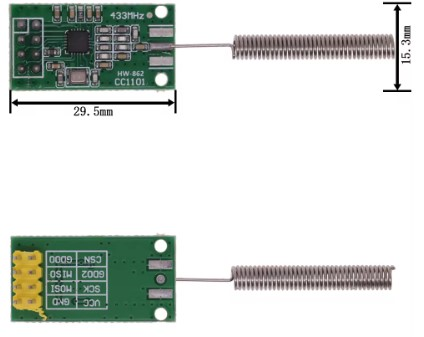
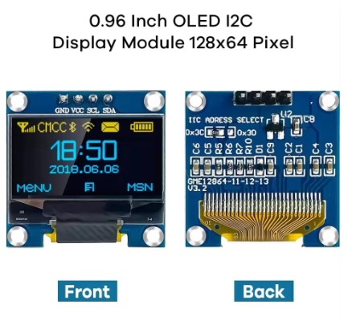

# esp32-433MHz-Rx-Tx-Test
Capture and Replay signals using classic Arduino Receiver & Transmitter or with cc1101.
# IF some .ino CODE contains rcswitch.h then It MEANS SUPPORT Receive & Transmit ONLY 24 BIT Signal !
## CONNECTION for classic Receiver and Transmitter :
# 🛠️ Receiver --> esp32 🛠️
- VCC --> 3.3V
- GND --> GND
- Pin --> GPIO 02

## 🛠️ Transmitter --> esp32 🛠️
- VCC --> 3.3V
- GND --> GND
- Pin --> GPIO 04

## 🛠️ CONNECTION for cc1101 with esp32 🛠️
# cc1101 --> esp32
- VCC --> 3.3V
- GND --> GND
- MISO --> GPIO19
- MOSI -->	GPIO23
- SCK --> GPIO18
- CSN --> GPIO5
- GDO0 --> GPIO4

## Oled --> esp32
- VCC --> 3.3V
- GND --> GND
- SCL --> GPIO 22
- SDA --> GPIO 21

### 📝 NOTE 📝
- 📝 DO NOT UPLOAD code which DOESN´T USE some components (If unsupported component is connected)
- 📝 UPLOAD SPECIFFIC CODE ONLY When u use Full set (like Display / or without, Serial usage / or without)
- 📝 ! PLEASE READ SPECIFFIC DOCS DOWN ! 📝

# 👉 Checkout Video👈
- (Click on IMG)

### 📌Speciffic Docs / INFO 📌
## Code name : "esp32-Rx&Tx-Test-3Pin.ino"
- ONLY controlled by SERIAL MONITOR Inside Arduino IDE
- Baud Rate 9600
- Commands : rx, tx, clear
- Meaning of commands :
- type rx to Serial Monitor for switch to RX Mode (Capturing SIGNAL 24 BIT MAX idk why it cannot capture more than 24 BIT Lenght)
- type tx to Serial Monitor for switch to TX Mode (Captured Signal Going to be TRANSMITTED on 433 MHz Freq)
- type clear Serial Monitor for clearing everithing
- ----------------------------------------------------------
## Code name "esp32-cc1101-SignalTest.ino"
- Here I going to add more INFO for cc1101 ...
- Didnt tested yet by myself :/
- ----------------------------------------------------------
### Fixed Bugs
- Fixed BUG when display cant be cleared
- Other bugs fixed ...
- ----------------------------------------------------------
# IMAGES
- Here is 433 MHz Receiver with Transmitter image from AliExpress only cost 2 € (price for Receiver & Transitter)

- And u can also use cc1101 it cost 2 € for 1 pcs
-

- and filally 0.96" Oled Display cost maybe 2 €
-

