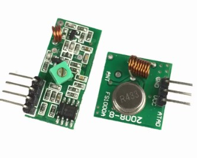
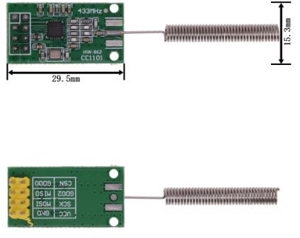
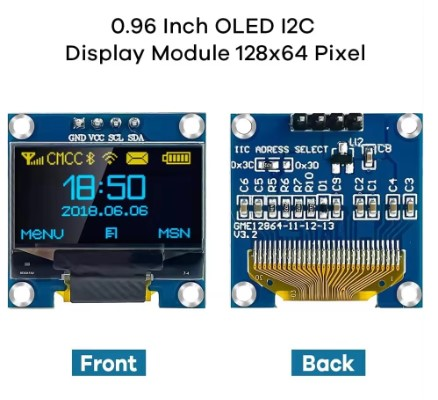

# esp32-433MHz-Rx-Tx-Test

---

<p align="center">
  
  
  
</p>

---

## for GRAPHICAL version go here 
[Click Here](https://github.com/Fattcat/RF-TechCat)
[Click Here](https://github.com/Fattcat/RF-TechCat/blob/main/RF-TechCat-DEMO.ino)

<div align="center" height: 200px; width: 50px;>
  
</div>

Capture and Replay signals using classic Arduino Receiver & Transmitter or with cc1101.
## IF some .ino CODE contains rcswitch.h then It MEANS SUPPORT Receive & Transmit ONLY 24 BIT Signal !
## CONNECTION for classic Receiver and Transmitter :
## Supported rc-switch.h version ***2.6.4***
# 🛠️ Receiver --> esp32 🛠️
- VCC --> 3.3V
- GND --> GND
- Pin --> GPIO 02

- If you want WiFi, then use ``esp32-RxTx-WiFi-EEPROM.ino```
  - [x] Receive
  - [x] Transmit
  - [x] Watch status
  - [x] Edit
  - [x] Save captured signals to EEPROM
  - [x] Nice GUI to control
  - [ ] Bruteforce (Working on it)
  - [ ] Supported cc1101 (its more difficult to work with)

## for best usage PLS USE code "esp32-Rx&Tx-OLED.ino" (cuz there is all u need to use) other codes are experimental
# Also supported RollingCode function

## 🛠️ Transmitter --> esp32 🛠️
- VCC --> 3.3V
- GND --> GND
- Pin --> GPIO 04

## 🛠️ Receiver --> esp32 🛠️
- VCC --> 3.3V
- GND --> GND
- Pin --> GPIO 02

## 🛠️ CONNECTION for cc1101 with esp32 🛠️
# cc1101 --> esp32
- VCC --> 3.3V
- GND --> GND
- MISO --> GPIO19
- MOSI -->	GPIO23
- SCK --> GPIO18
- CSN --> GPIO5
- GDO0 --> GPIO4

# Oled --> esp32
- VCC --> 3.3V
- GND --> GND
- SCL --> GPIO 22
- SDA --> GPIO 21

# 📝 NOTE 📝
- 📝 DO NOT UPLOAD code which DOESN´T USE APPROPRIATE components (If unsupported component is connected)
- 📝 UPLOAD SPECIFFIC CODE ONLY When u use Full set (like Display / or without, Serial usage / or without)
- 📝 ! PLEASE READ SPECIFFIC DOCS DOWN ! 📝

# 👉 Checkout Video👈
- (Click on IMG)
[](https://www.youtube.com/shorts/KTenIR3jttA)

# 📌Speciffic Docs / INFO 📌
## Code name : "esp32-Rx&Tx-Test-3Pin.ino"
- ONLY controlled by SERIAL MONITOR Inside Arduino IDE
- Baud Rate 9600
- Commands : rx, tx, clear
- Meaning of commands :
- type rx to Serial Monitor for switch to RX Mode (Capturing SIGNAL 24 BIT MAX idk why it cannot capture more than 24 BIT Lenght)
- type tx to Serial Monitor for switch to TX Mode (Captured Signal Going to be TRANSMITTED on 433 MHz Freq)
- type clear Serial Monitor for clearing everithing
- ----------------------------------------------------------
## Code name : "esp32-cc1101-SignalTest.ino"
- Here I going to add more INFO for cc1101 ...
- Today tested by myself but it didnt Receive Signal :/
- In previous code was suspicious error in code which caused Transmit "Jamming Signal" idk why ...
- ----------------------------------------------------------
### Fixed Bugs
- Fixed BUG when display cant be cleared
- Other bugs fixed ...
- ----------------------------------------------------------
# IMAGES
- Here is 433 MHz Receiver with Transmitter image from AliExpress only cost 2 € (price for Receiver & Transitter)

- And u can also use cc1101 it cost 2 € for 1 pcs
- 



- and filally 0.96" Oled Display cost maybe 2 €


