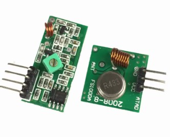

# esp32-433MHz-Rx-Tx-Test
Capture and Replay signals using classic Arduino Receiver & Transmitter or with cc1101.

## CONNECTION for classic Receiver and Transmitter :
### Receiver --> esp32
- VCC --> 3.3V
- GND --> GND
- Pin --> GPIO 02

### Transmitter --> esp32
- VCC --> 3.3V
- GND --> GND
- Pin --> GPIO 04

## CONNECTION for cc1101 with esp32 :
### cc1101 --> esp32

- VCC --> 3.3V
- GND --> GND
- MISO --> GPIO19
- MOSI -->	GPIO23
- SCK --> GPIO18
- CSN --> GPIO5
- GDO0 --> GPIO4

# IMAGES
- Here is 433 MHz Receiver with Transmitter image from AliExpress only cost 2 € (price for Receiver & Transitter)

- And u can also use cc1101 it cost 2 € for 1 pcs

- and filally 0.96" Oled Display cost maybe 2 €

